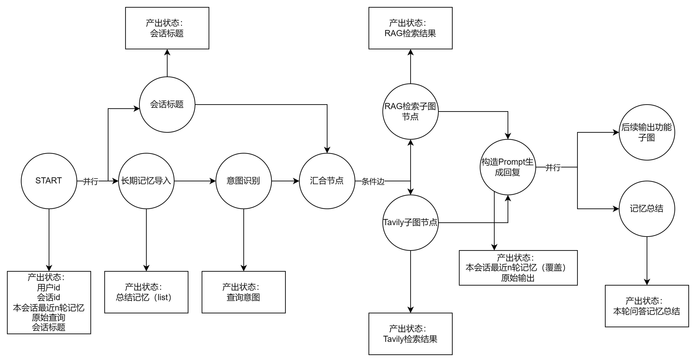

# 用户检索流程

## 一、功能需求：

- 智能总结长期记忆
- 提取会话名（映射——会话ID）
- 根据需求在状态中明确表示工具选择
- 短期记忆
- 意图识别（工具选择）

## 二、功能分析

下图为初步的工作流节点定义，及对状态产出的规划

1. 首先在进入工作流的时候，通过.stream()传参，从磁盘和用户请求中获取并传递**用户id、会话id、最近n轮的完整对话记忆、原始查询语句**。
2. 并行进入会话标题节点与长期记忆导入节点，因为会话标题节点与意图识别节点都涉及LLM调用，并行提高响应速度。
   1. 会话标题节点，如果会话标题为空，则通过LLM结合Prompt，将用户查询概括为一句话总结，作为本次会话的标题
   2. 长期记忆导入节点，从磁盘读取长期记忆的全部总结条目，写入状态
3. 意图识别节点，通过小参数量模型快速识别出查询意图，输出RAG检索&Tavily MCP的是否选择的布尔值状态，留置后续使用
4. 汇合节点，等待前置节点全部执行的汇总功能。
5. 条件边，根据之前的两个布尔值状态选择后续通路
   1. RAG检索子图节点：传递原始问题，将查询功能封装到该节点中，返回查询处理后的结果
   2. Tavily 子图节点：传递原始问题，通过调用Tavily查询，返回查询后结果
   3. 这两个子图进行时，会流式响应出当前执行状态，并输出到前端供用户查看处理进度。
6. 生成回复节点，待前序节点处理完成进入该节点，从状态提取构造回复所需语料进行生成，将最近新n轮问答内容覆盖写入状态
7. 并行进入记忆总结节点，生成本轮的记忆总结，并对短期记忆的全部内容重新覆盖式落盘，将本轮的记忆总结续写落盘
8. 并行进入后续输出功能的子图，这里为后续的输出进行预留，可能是多种格式的文件或者纯文本输入，需要后续具体设计。同时该部分需要加入中断处理与回环工作流设置，值得后续大幅度扩展。



## 三、节点

### 3.1 长期记忆导入节点

​	从磁盘读取该会话的全部长期记忆总结，写入状态

```py
memory_summary:List[str]
```

### 3.2 会话标题

​	调用`llm`生成本次对话的标题（如果还没生成）

```python
conversation_title:str
```

### 3.3 意图识别

​	调用`llm`生成查询意图的结果，用于后续条件边的判断，是使用RAG检索、MCP使用，还是两者并行使用

```
rag_use:bool
tavily_use:bool
```

### 3.4 RAG检索子图

​	该子图的节点及状态需要根据实际情况适时制定和调整

### 3.5 Tavily子图

​	同上

### 3.6 生成回复

​	从状态中接收长期记忆、短期记忆、原始提问、检索的数据，构造提示词，调用llm实现回复生成

```
final_answer
conversation_history: List[Tuple[str, str]]
```

### 3.7 记忆总结

​	总结本轮的原始输入与输出，生成本轮的总结记忆，并写入落盘

### 3.8 后续输出功能子图

​	使用状态中的数据信息完成输出部分，暂未确定

## 四 状态

​	本工作流使用LangGraph搭建，其中包含三个子图。对于全局状态的设置如下：

